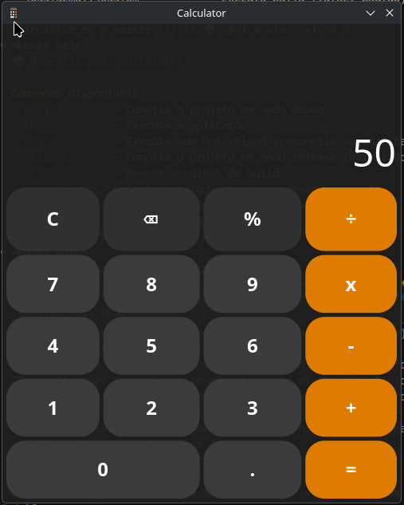

# Calculator

Uma aplicação de calculadora desktop desenvolvida em Rust + Slint.



---

## � Descrição

Este é um projeto de calculadora desktop com interface gráfica moderna. A aplicação foi desenvolvida usando Rust como linguagem de programação e Slint como framework para a interface do usuário.

**Características:**

- Interface limpa e moderna
- Operações matemáticas básicas
- Design responsivo com componentes customizados
- Janela de tamanho fixo otimizado

---

## 📦 Pré-requisitos

Para rodar este projeto, você precisa ter instalado:

- **Rust** (versão mais recente)
- **Cargo** (gerenciador de pacotes do Rust - já vem com o Rust)

### Instalando o Rust

```bash
curl --proto '=https' --tlsv1.2 -sSf https://sh.rustup.rs | sh
```

Ou acesse: https://rustup.rs/

---

## 🚀 Como Rodar

### Opção 1: Usando Makefile (Recomendado)

```bash
# Clone o repositório
git clone https://github.com/marcos2872/calculator.git
cd calculator

# Execute a aplicação
make run
```

**Outros comandos úteis:**

```bash
make watch      # Desenvolvimento com hot reload
make build      # Compila em modo debug
make release    # Compila versão otimizada
make clean      # Limpa arquivos de build
make help       # Ver todos os comandos
```

### Opção 2: Usando Cargo direto

```bash
# Clone o repositório
git clone https://github.com/marcos2872/calculator.git
cd calculator

# Execute a aplicação
cargo run

# Ou compile e execute versão otimizada
cargo build --release
./target/release/calculator
```

---

## � AppImage (Build e Instalação)

Gere um executável portátil (.AppImage) para distribuir ou executar a aplicação sem instalar dependências.

Observação: o script baixa automaticamente o appimagetool se não estiver disponível no sistema.

### Gerar o AppImage

Usando Makefile (recomendado):

```bash
make appimage
```

Saída esperada:

```
dist/appimage/calculator-<versão>-<arquitetura>.AppImage
```

Exemplos de arquitetura: x86_64, aarch64.

### Instalar o AppImage no sistema

Instala em /opt/calculator, cria atalho em /usr/local/bin/calculator e adiciona ao menu de apps.

```bash
make install-appimage
```

Alternativa direta com script (caso queira apontar um arquivo específico):

```bash
sudo ./install-appimage.sh dist/appimage/calculator-<versão>-<arquitetura>.AppImage
```

Após a instalação, você pode abrir pelo menu como "Calculator" ou via terminal:

```bash
calculator
```

### Executar sem instalar

Torne o arquivo executável (se necessário) e rode diretamente:

```bash
chmod +x dist/appimage/calculator-<versão>-<arquitetura>.AppImage
./dist/appimage/calculator-<versão>-<arquitetura>.AppImage
```

### Desinstalar (manual)

Caso tenha usado a instalação acima, remova os arquivos do sistema:

```bash
sudo rm -rf /opt/calculator
sudo rm -f /usr/local/bin/calculator \
			/usr/share/applications/calculator.desktop \
			/usr/share/pixmaps/calculator.png \
			/usr/share/icons/hicolor/256x256/apps/calculator.png
sudo update-desktop-database /usr/share/applications || true
sudo gtk-update-icon-cache -f /usr/share/icons/hicolor || true
```

---

## �🛠️ Tecnologias

- **[Rust](https://www.rust-lang.org/)** - Linguagem de programação
- **[Slint](https://slint.rs/)** - Framework UI

---

## � Estrutura do Projeto

```
calculator/
├── src/
│   └── main.rs           # Código principal
├── ui/
│   ├── app.slint         # Interface principal
│   └── components/       # Componentes reutilizáveis
├── assets/
│   └── logo.png          # Ícone da aplicação
├── images/
│   └── 1.png             # Screenshot
├── Cargo.toml            # Dependências do projeto
├── Makefile              # Comandos de build
└── README.md             # Este arquivo
```

---

## ‍💻 Autor

**Marcos** - [@marcos2872](https://github.com/marcos2872)

---

## � Licença

MIT License
